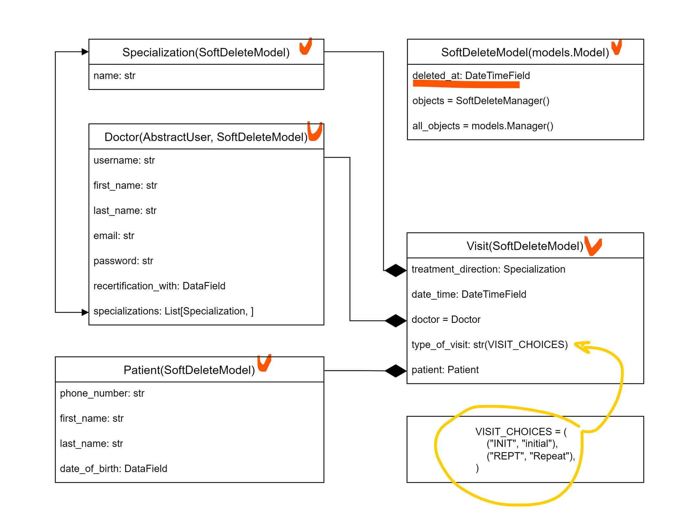

# ToTheDoctor • project for managing visits, doctors and patients for a medical clinic
___

## Description
A simple service that allows the clinic administrator to make an appointment with a doctor for a patient

- The administrator has all permissions: can create, update, delete visits, doctors and patients 
- The doctors do not have permissions to creating, updating, or deleting doctors

### Logic of use
- **step 1.** The clinic administrator creates a patient if he is not in the clinic database

- **step 2.** Creates a visit, indicating the direction of treatment (for example 
surgery, therapy, rehabilitation, etc.), time and date of the visit, type of visit (initial or repeat)


### Implemented checks:
- date of birth of the patient (an appointment with a doctor is possible from 6 months of age)
- expiration date of the medical certificate
- date of registration for the visit (cannot be less than the current date)


### Implemented a Soft-Delete method
- the process of removing records so that they are still present in the database but are
not accessible to the user


### The models are implemented according to the following diagram:



## Implementation
- The backend of the application is written and tested in Python 3.12.1, Django 4.2.7
- The frontend of the application is written in HTML + bootstrap 4.2.6
- Authorization takes place using a token
- The repository contains the source code


## Description of the structure
* `/admin/` -- login to Django admin panel
* `POST /accounts/login/` -- login
* `POST /accounts/logout/` -- logout
* `GET /visits/` -- list of visits (available for authorized users)
* `POST /visits/create/` -- creating a visit
* `GET /users/doctors/` -- current list of doctors of the medical institution
* `GET /users/doctors/1/` -- doctor with id 1
* `GET /users/patients/` -- current list of patients of the medical institution


## Installation
```
$ git clone https://github.com/OleksiiKiva/to-the-doctor.git
$ cd to-the-doctor
$ make
$ make run
```

## Access
The application will be available at: [http://localhost:8000](http://localhost:8000) 

Admin login: `admin@site.com`
Admin password: `Admin-12345`

Doctors password: `Doctor12345`


## Contacts
Please send bug reports and suggestions to:
[oleksii.kiva@gmail.com](mailto:oleksii.kiva@gmail.com)